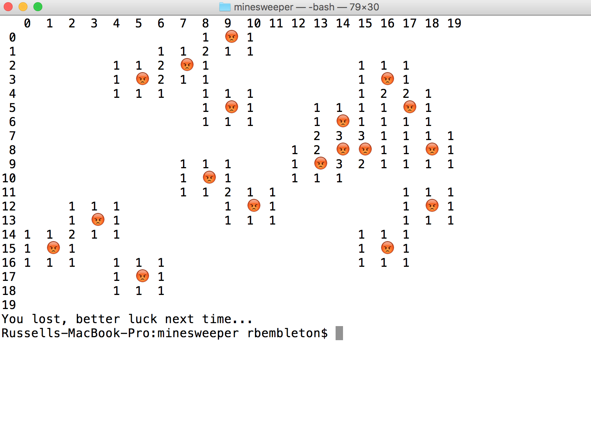

# Minesweeper

Fun version of Minesweeper, completely in terminal. Uses emojis to mimic the feel of the original Minesweeper and allows users to choose the size and challenge level of their board.

## Features

- emojis, appropriately integrated with plain text
- OOP
- clear and clean UI/UX

## Screenshots

